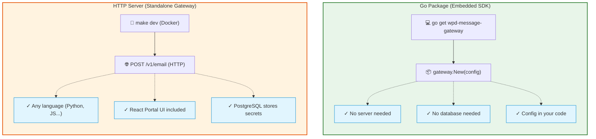
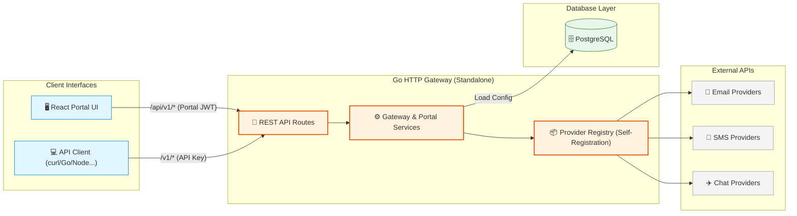

<p align="center">
  <picture>
    <source media="(prefers-color-scheme: dark)" srcset="frontend/public/logo-dark-mode.svg">
    
  </picture>
</p>

<p align="center">
  <!-- Build & CI -->
  <a href="https://github.com/weprodev/wpd-message-gateway/actions/workflows/ci.yml"></a>
  <!-- Quality & Go -->
  <a href="https://goreportcard.com/report/github.com/weprodev/wpd-message-gateway"></a>
  <a href="https://pkg.go.dev/github.com/weprodev/wpd-message-gateway"></a>
  <!-- License -->
  <a href="https://github.com/weprodev/wpd-message-gateway/blob/main/LICENSE"></a>
</p>

<p align="center">
  <strong>A unified messaging solution for Email, SMS, Push, and Chat.</strong>
</p>

This project offers two distinct ways to integrate messaging into your architecture:
1. **Embedded Go SDK:** A lightweight library for your Go applications. Send messages natively without running a separate server or database.
2. **Standalone HTTP Gateway:** A fully-featured service deployable via Docker. Provides a unified REST API for any programming language, backed by PostgreSQL and a React UI.

Write your messaging code once — switch between different email, SMS, and chat providers without changing a single line of application code.

---

## Key Features

- **Unified Interface:** Send Email, SMS, Push, and Chat messages through one consistent API.
- **Provider Abstraction:** Change a configuration value to switch providers, not your code.
- **DB-First Configuration:** Provider catalog, fields, credentials, and settings stored in PostgreSQL and resolved dynamically.
- **Workspace Isolation:** Multi-tenant support for separate providers, API keys, and templates per workspace.
- **Developer-Friendly:** Includes a local Memory provider to capture messages locally and assert real payloads without mocking.

---

## Two Ways to Use



---

## System Architecture

WPD Message Gateway is structured with clean architecture separation, allowing the same provider registry to run either in-process (SDK mode) or as a distributed service (Standalone HTTP mode).



### 1. Embedded Go SDK (`pkg/gateway`)
* **Zero Dependencies**: Requires no database, cache, or background server. It runs completely inside your application process.
* **Provider Registry**: Uses Go's self-registration factory mechanism (Open/Closed Principle) to register messaging adapters.
* **In-Memory Simulator**: Includes a built-in memory provider to capture sent payloads in-process, allowing you to test messaging without making actual network calls.

### 2. Standalone HTTP Server (`cmd/server`)
* **Layered Clean Architecture**:
  * **Presentation Layer**: Thin Echo HTTP handlers mapped under RBAC permissions.
  * **Core Layer**: Domain services executing business logic and orchestrating providers.
  * **Infrastructure Layer**: PostgreSQL repository implementations storing API keys, workspace configurations, integrations, templates, and request logs.
* **DB-First Configuration**: Provider credentials (stored AES-encrypted) and settings reside in PostgreSQL as the single source of truth—no server-side configuration files needed for provider setup.
* **Context-Aware Tracing**: Context-aware structured logger (`slog`) automatically maps request correlation IDs across all handlers, services, and repositories to trace requests end-to-end.

### 3. Portal React UI (`frontend/`)
* **Modern UI & Design System**: A responsive React 19 single-page application built with Vite and clean CSS tokens.
* **Dynamic Integrations UI**: Instead of hardcoding vendor configurations, the UI dynamically fetches provider metadata from the database and renders tailored configuration forms for connecting new providers.
* **Workspace Isolation**: Allows tenant-level scoping of connected integrations, logs, and send tests.

---


## Quick Start

### Option A: Embedded Go SDK

Install the SDK:

```bash
go get github.com/weprodev/wpd-message-gateway
```

Send an email in 10 lines:

```go
package main

import (
    "context"
    "log"

    "github.com/weprodev/wpd-message-gateway/pkg/contracts"
    "github.com/weprodev/wpd-message-gateway/pkg/gateway"
)

func main() {
    gw, err := gateway.New(gateway.Config{
        DefaultEmailProvider: "mailgun",
        EmailProviders: map[string]gateway.EmailConfig{
            "mailgun": {
                CommonConfig: gateway.CommonConfig{APIKey: "key-xxx"},
                Domain:       "mg.example.com",
                FromEmail:    "noreply@example.com",
            },
        },
    })
    if err != nil {
        log.Fatal(err)
    }

    result, err := gw.SendEmail(context.Background(), &contracts.Email{
        To:      []string{"user@example.com"},
        Subject: "Welcome!",
        HTML:    "<h1>Hello!</h1>",
    })
    if err != nil {
        log.Fatal(err)
    }
    log.Printf("Sent! ID: %s", result.ID)
}
```

No server. No database. Just `go get` and send.

---

### Option B: Standalone HTTP Gateway

The easiest way to get the standalone server running is with Docker Compose.

**Prerequisites:** Docker and Docker Compose

```bash
# 1. Clone the repository
git clone https://github.com/weprodev/wpd-message-gateway.git
cd wpd-message-gateway

# 2. Start the gateway, PostgreSQL, and Portal UI
make dev
```

Once running:

1. Open **http://localhost:10104** — the Portal UI
2. Create an account and sign in (or use the pre-seeded demo user: `demo@example.com` / `password`)
3. Select the pre-seeded workspace or create a new workspace, create an API key, and configure integrations directly in the Portal UI. (Alternatively, you can bootstrap via the REST API; see [E2E Bootstrap Guide](docs/backend/e2e-testing.md#2-bootstrap-create-workspace-and-api-key) for details).
4. Send a message from any language:

```bash
curl -X POST http://localhost:10101/v1/email \
  -u "wk_client_id:your_secret" \
  -H "X-Workspace-Key: myapp" \
  -H "Content-Type: application/json" \
  -d '{"to":["user@example.com"],"subject":"Hello","html":"<h1>World</h1>"}'
```

<details>
<summary><strong>Alternative: Manual Setup (No Docker)</strong></summary>

If you prefer to run components directly on your machine:
**Prerequisites:** Go 1.22+, PostgreSQL, Node.js 20+

```bash
git clone https://github.com/weprodev/wpd-message-gateway.git
cd wpd-message-gateway
cp configs/local.example.yml configs/local.yml   # edit DB credentials here

make install
make start
```
</details>

---

## Why Message Gateway?

| Problem | Solution |
|---------|----------|
| Each provider has a different API | **Unified interface** — Email, SMS, Push, Chat through one consistent API |
| Switching providers means rewriting code | **Provider abstraction** — change a config value, not your code |
| Credentials scattered in env vars | **DB-first config** — all secrets in PostgreSQL, managed via Portal UI |
| Hard to test messaging in CI | **Memory provider** — captures messages locally, assert real payloads without mocking |
| Multi-tenant apps need isolation | **Workspace isolation** — separate providers, API keys, templates per workspace |

---

## Portal UI

Available at **http://localhost:10104** when the server runs.

| Feature | Description |
|---------|-------------|
| **Sign in / Register** | Register and sign in with first/last name (JWT-based session authentication) |
| **Workspaces** | Create, view, and select workspaces |
| **Message Logs** | Audit trail of gateway send requests with detailed metadata |
| **Email Inbox** | Read and test outbound messages captured in real-time by the secure memory simulator |
| **Email Templates** | Create and manage reusable HTML layouts and template assets |
| **Integrations** | Dynamically view, configure, and connect messaging providers |
| **Settings** | Configure workspace PIN, owner email, data retention policy, and manage/rotate API keys |
| **Send Test** | Run manual test sends for any supported channel directly from the dashboard |

All workspace management and developer tools are fully accessible directly via the Portal UI. The Portal REST API is also fully documented for automated workflows. See [Usage guide](docs/backend/usage.md) and [Portal inbox](docs/backend/portal-inbox.md).

---

## Configuration

The gateway enforces a strict separation between **server infrastructure** and **messaging credentials**:

1. **Server Configuration (`configs/local.yml`):**
   This file handles the operational infrastructure. Copy `configs/local.example.yml` to `configs/local.yml`.
   - `DISPATCH_MODE`: Defines if messages are sent for real (`provider_only`), captured (`memory_only`), or both.
   - Database credentials (`DB_HOST`, `DB_USER`, etc.) for PostgreSQL.
   - `JWT_SECRET` for Portal UI session authentication.
   *(Note: Never place provider credentials like API keys in this file.)*

2. **Provider credentials (server mode):**
   Stored AES-encrypted in PostgreSQL. Configure dynamically via the **Integrations** tab in the **Portal UI** (or programmatically via the Portal REST API). See [Usage guide](docs/backend/usage.md) and [E2E bootstrap](docs/backend/e2e-testing.md).

## E2E Testing

Use `memory_only` dispatch mode in CI/CD to capture messages without sending real emails or SMS. Then assert the payloads via the Portal Inbox API.

No mocking. Real HTTP calls. Full payload assertions.

```yaml
# docker-compose.test.yml — drop in with your CI
services:
  message-gateway:
    image: weprodev/wpd-message-gateway
    environment:
      DISPATCH_MODE: memory_only
```

📖 Full setup guide: [E2E Testing with Docker & GitHub Actions](docs/backend/e2e-testing.md)

---

## Development Environment & Workflow

There are two primary ways to set up the development environment:

1. **Local Setup:** Using `make install` and `make start` with local dependencies (Go, Node, PostgreSQL).
2. **Docker Setup:** Using `make dev` as the recommended one-command method to run everything via Docker Compose.

| Command | Description |
|---------|------------|
| `make install` | Install Go + frontend dependencies |
| `make start` | Start Gateway API + Portal UI |
| `make dev` | Run via Docker Compose (includes PostgreSQL) |
| `make test` | Run Go tests |
| `make audit` | Full quality gate: fmt + lint + test (Go + frontend) + govulncheck + build |
| `make build` | Compile Go binary + build frontend (no tests) |
| `make ui` | Portal UI only (Vite dev server, port 10104) |
| `make storybook` | Component library (Storybook, port 6006) |
| `make upgrade` | Upgrade all dependencies |

This project uses a spec-driven, AI-assisted development workflow. See the [Development Flow](docs/development-flow.md) documentation for details on Spec Kit commands and Agent Mapping.

---

## Project Structure

```
wpd-message-gateway/
├── cmd/server/          # HTTP server entry point
├── configs/             # Server config (ports, JWT) — NOT provider credentials
├── database/
│   ├── migrations/      # SQL schema migrations
│   └── seeds/           # Optional demo data
├── internal/
│   ├── app/             # Config, wire, validation, provider registration
│   ├── core/            # Domain models, services, ports (interfaces)
│   ├── infrastructure/  # Provider adapters + Postgres repos + logger
│   ├── presentation/    # HTTP router, handlers, middleware
│   └── registry/        # Provider factory registry (self-registration via init)
├── pkg/                 # Public Go packages
│   ├── contracts/       # Email, SMS, Push, Chat message types
│   └── gateway/         # Embedded SDK — gateway.New()
├── frontend/            # React Portal UI (Vite + TypeScript + Tailwind)
├── tests/bruno/         # HTTP API test collection (Bruno)
├── specs/               # Feature specifications (Spec Kit)
└── docs/                # Documentation
```

---

## Documentation

| Document | Description |
|----------|------------|
| [Docs Hub](docs/README.md) | Index of all backend + frontend documentation |
| [Usage Guide](docs/backend/usage.md) | SDK and HTTP API reference, authentication, multi-language examples |
| [Architecture](docs/backend/architecture.md) | System design, two modes of operation, DB schema |
| [Portal Inbox](docs/backend/portal-inbox.md) | Message inbox, dispatch modes, inbox API |
| [E2E Testing](docs/backend/e2e-testing.md) | CI/CD integration, capturing and asserting messages |
| [Contributing](docs/backend/contributing.md) | Adding new providers, code quality gates |
| [Code Conventions](docs/backend/code-conventions.md) | Go coding standards |
| [Frontend Docs](docs/frontend/README.md) | Portal UI — Vite, TypeScript, shadcn/ui, conventions |
| [Frontend Engineer](docs/frontend/frontend-engineer.md) | Principal-style workflow, architecture, Storybook |
| [Backend Engineer](docs/backend/backend-engineer.md) | Go layers, registry, security, quality gate |
| [Workflow](docs/workflow.md) | CI/CD and release process |
| [Development Flow](docs/development-flow.md) | Spec Kit workflow and AI-Assisted Development |
| [Bruno Collections](tests/bruno/) | HTTP API tests |

---

## Contributing

1. **Report bugs** — [Open an issue](https://github.com/weprodev/wpd-message-gateway/issues)
2. **Suggest features** — Ideas and discussions welcome
3. **Pull requests** — Code, docs, and tests
4. **Add providers** — See [Contributing Guide](docs/backend/contributing.md)
5. **Sponsor** — Support ongoing development

> Run **`/smell develop`** then **`make audit`** before opening a PR — see [docs/agents/verification.md](docs/agents/verification.md).

---

## Licensing & Sponsorship

Released under the **[MIT License](LICENSE)**.

| Who | What we ask |
|-----|------------|
| Individuals, learning, side projects | Use freely. Sponsorship optional. |
| Small teams | Use freely. Consider sponsoring if it's central to your stack. |
| Mid-size companies & enterprises | **Please [sponsor](https://github.com/sponsors/weprodev)** |
| Qualifying non-profits | Use freely. Sponsorship optional. |

<p align="center">
  <a href="https://github.com/sponsors/weprodev">
    
  </a>
</p>

---

<p align="center">
  Built with ❤️ by <a href="https://github.com/weprodev">WeProDev</a>
</p>
