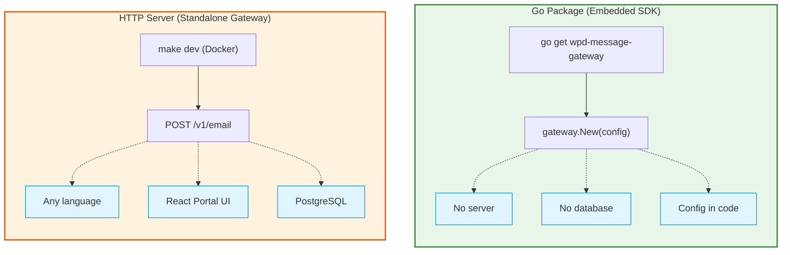
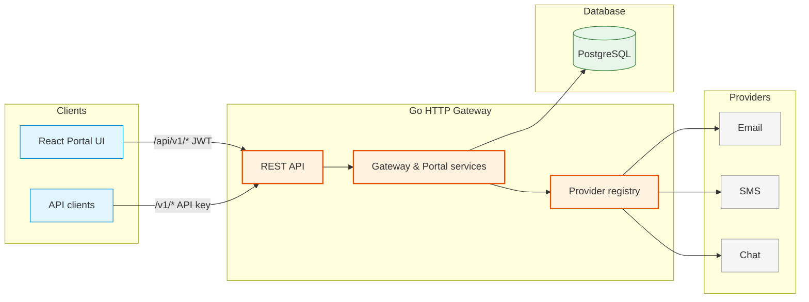

<p align="center">
  <picture>
    <source media="(prefers-color-scheme: dark)" srcset="frontend/public/logo-dark-mode.svg">
    
  </picture>
</p>

<p align="center">
  <a href="https://github.com/weprodev/wpd-message-gateway/actions/workflows/ci.yml"></a>
  <a href="https://pkg.go.dev/github.com/weprodev/wpd-message-gateway"></a>
  <a href="https://github.com/weprodev/wpd-message-gateway/blob/main/LICENSE"></a>
</p>

Unified messaging for **Email, SMS, Push, and Chat** — one API, swappable providers.

Use it as an **embedded Go SDK** (`pkg/gateway`, no server) or as a **standalone HTTP gateway** with PostgreSQL and a React portal. Details: [docs/](docs/README.md).

## Two ways to use



## Architecture



---

## Quick start (Docker)

**Requires:** Docker

```bash
git clone https://github.com/weprodev/wpd-message-gateway.git
cd wpd-message-gateway
make dev
```

| Service | URL |
|---------|-----|
| Portal UI | http://localhost:10104 |
| Gateway API | http://localhost:10101 |

### Demo account

Seeded on first DB init. Reset anytime: `make seed-demo`.

| | |
|--|--|
| Portal | `demo@weprodev.com` / `secret` |
| API key | `demo-client-id` / `demo-secret` |
| Workspace ID | `00000000-0000-0000-0000-000000000001` |

```bash
curl -X POST http://localhost:10101/v1/email \
  -u "demo-client-id:demo-secret" \
  -H "X-Workspace-Key: 00000000-0000-0000-0000-000000000001" \
  -H "Content-Type: application/json" \
  -d '{"to":["user@example.com"],"subject":"Hello","html":"<h1>World</h1>"}'
```

---

## Go SDK

```bash
go get github.com/weprodev/wpd-message-gateway
```

```go
gw, _ := gateway.New(gateway.Config{ /* providers in code */ })
gw.SendEmail(ctx, &contracts.Email{To: []string{"a@b.com"}, Subject: "Hi", HTML: "<p>Hi</p>"})
```

No database, no HTTP server. Full examples: [usage guide](docs/backend/usage.md).

---

## Local development (no Docker)

Go 1.26+, PostgreSQL 17+, Node 20+.

```bash
cp configs/local.example.yml configs/local.yml   # set DB + secrets
make install && make start
```

Migrations and seeds: [usage guide](docs/backend/usage.md).

| Command | |
|---------|--|
| `make dev` / `make dev-down` | Docker up / down |
| `make seed-demo` | Re-apply demo seeds |
| `make audit` | Lint, test, build (pre-PR gate) |

Run `make help` for the full list.

---

## Documentation

Everything else lives under **[docs/](docs/README.md)** — API reference, architecture, E2E testing, contributing.

---

## Contributing

Issues and PRs welcome. Before opening a PR: `make audit`. See [contributing](docs/backend/contributing.md).

MIT License — [LICENSE](LICENSE).

<p align="center">
  <a href="https://github.com/sponsors/weprodev">Sponsor</a> ·
  <a href="https://github.com/weprodev">WeProDev</a>
</p>
